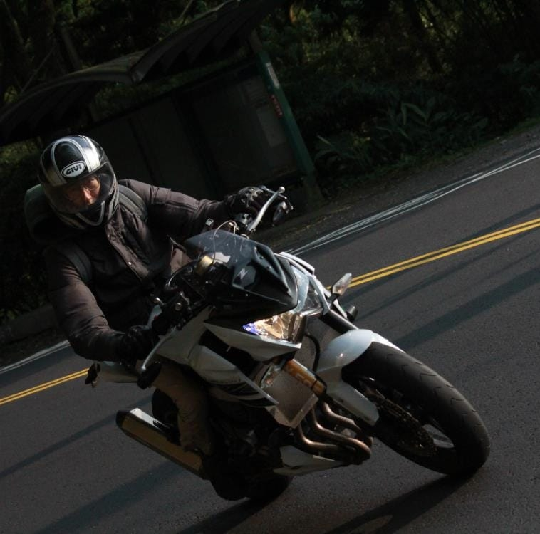
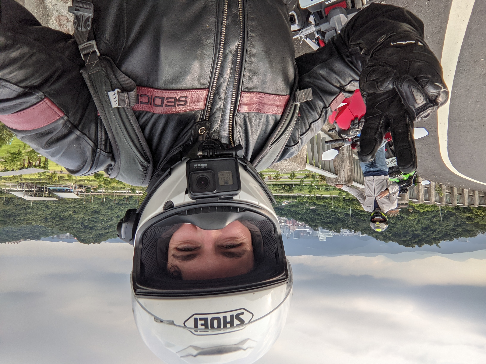

Fluent English / Chinese motor vehicle services are managed almost entirely by Mr. Lobster.

Why he's called Mr. Lobster remains a mystery. He's a Malaysian-born Taiwanese permanent resident
with over a decade of experience fixing, buying, and selling cars, scooters, and motorcycles in
Taiwan.

The website is maintained by Caleb Rogers, a software engineer and founding member of the software
engineering co-op [508.dev](https://508.dev).

